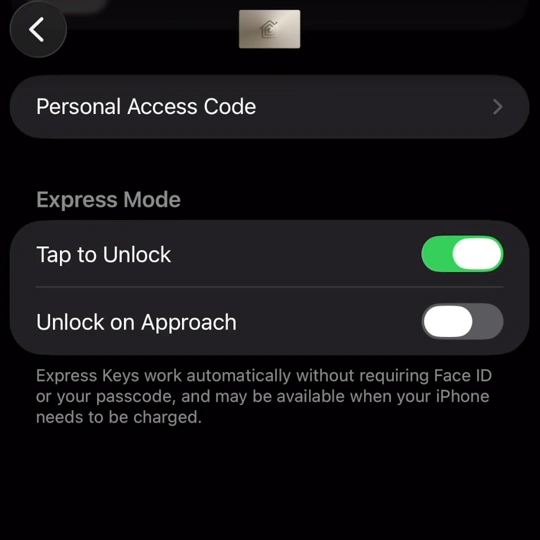
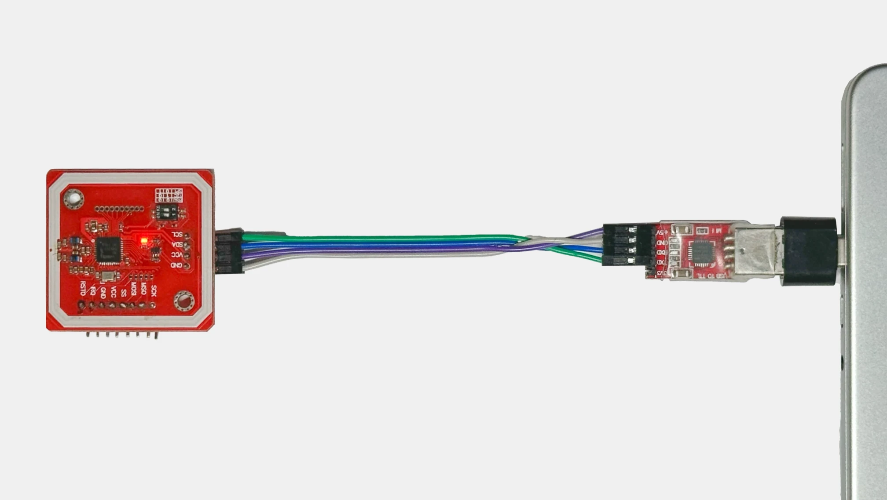

# Python Aliro Reader

<p float="left">
  
</p>

> [!CAUTION]
> At the current moment, this project **does not** provide built-in credential issuance/provisioning for user devices.
> Users are fully responsible for procuring valid Aliro credentials and reader configuration material at this time.

## Overview

This project provides a Python-based implementation of the NFC part of the Aliro protocol, including the following commands:
- AUTH0;
- AUTH1;
- EXCHANGE;
- ENVELOPE.

## Requirements

- **A way to procure valid credentials/reader configuration material externally (not provided by this project at this moment)**;
- Linux or macOS;
- Python 3.10+;
- PN532 connected over UART or USB (recommended/tested path);

For PC usage with PN532 via UART connect as follows:

<p float="left">
  
</p>

## Installation And Running

| Step                    | `uv` (recommended)        | `pip`                                                                   |
|-------------------------|---------------------------|-------------------------------------------------------------------------|
| 1. Install dependencies | `uv sync`                 | `python3 -m pip install --upgrade pip`<br>`python3 -m pip install -e .` |
| 2. Configure            | `nano configuration.json` | `nano configuration.json`                                               |
| 3. Run                  | `uv run python main.py`   | `python3 main.py`                                                       |

## Configuration

Configuration lives in [`configuration.json`](./configuration.json).


### `logging`

- `level`: Python logging level integer (for example `20` for INFO).

### `nfc`

- `path`: NFC frontend path string.

Examples:

- PN532 serial: `tty:usbserial-0001:pn532`
- ACR122U USB: `usb:072f:2200`

If you need to discover serial ports:

```bash
# Linux
ls /dev/*

# macOS
ls /dev/tty.*
```

### `aliro`

- `persist`: path to JSON state file used by repository storage;
- `flow`: preferred minimum authentication flow. Supported values:
  - `expedited` / `fast` -> `FAST`,
  - `standard` -> `STANDARD`,
  - `attestation` / `step_up` / `stepup` -> `STEP_UP`;
- `authentication_policy`: user authentication policy string; supported values:
  - `user_device_setting` / `user` / `original` / `express` -> `USER_DEVICE_SETTING` (0x01),
  - `secure` -> `USER_DEVICE_SETTING_SECURE_ACTION` (0x02),
  - `force` -> `FORCE_USER_AUTHENTICATION` (0x03),
  defaults to `user`;
- `reader_certificate`: optional `LOAD CERT` source used before `AUTH1` when transaction goes through Standard/Step-up path:
  - `false` / omitted: do not send `LOAD CERT`;
  - `true`: generate a profile0000 certificate once at startup from `reader_private_key` using a generated intermediate subject key; active `reader_private_key` is then replaced with that intermediate private key for authentication;
  - `string`: profile0000 certificate bytes encoded as hex or base64;
  configured certificates are validated locally for profile format, and subject key is checked against `reader_private_key`;
- `step_up_scopes`: optional scope request map used in Step-up DeviceRequest for requested docTypes (`aliro-a` / `aliro-r` selected automatically from signaling bitmask):
  - string/array of strings: all scopes are sent with `keep=true`;
  - object map `scope -> keep marker`: each marker can be boolean or string (`keep` / `nokeep`);
  - defaults to `{"matter1": true}` when omitted.
- `reader_private_key`: reader private key as hex;
- `reader_group_identifier`: group identifier as hex;
- `reader_group_sub_identifier`: reader group sub-identifier as hex.


## Project Structure

- [`main.py`](./main.py): runtime entrypoint, configuration loading, NFC loop, signal handling;
- [`aliro/`](./aliro): core Aliro protocol/authentication logic module;
- [`repository.py`](./repository.py): state persistence for reader metadata/endpoints;
- [`util/afclf.py`](./util/afclf.py): modified contactless frontend transport helpers;
- [`util/`](./util): cryptography, ISO7816, TLV, ECP helpers.

## Runtime Artifacts

By default, the following state file is used:

- `persist.json`: stored endpoint data and reader identifiers.

## Current Limitations

- The project currently does not offer built-in Aliro credential provisioning or generation;
- Because of this, credential issuer validation is also currently omitted;
- Implementation predates the published Aliro specification and is only partially aligned, although sufficient for Fast and Standard flow.

## Contributing

If you've encountered an issue or would like to help improve this project, feel free to open an issue or submit a pull request.

Use of AI-assisted tools for contributions is welcome. However, as AI is a powerful tool that is subject to abuse, any wide-reaching or architectural changes made with AI assistance should be consulted with the maintainers beforehand.

## Security Notes

- This code is provided as-is. Considering the sensitive nature of authentication and security, the maintainers assume no responsibility for any issues that may arise while using this project;
- Logs and state files can contain sensitive data (keys, identifiers, endpoint metadata);
- Do not publish raw logs or state files from real environments.

## References

- [Specifications - Connectivity Standards Alliance](https://csa-iot.org/developer-resource/specifications-download-request/) - official Aliro specification;
- [Aliro - kormax](https://github.com/kormax/aliro) - aliro protocol info based on wallet app research;
- [Apple Home Key Reader - kormax](https://github.com/kormax/apple-home-key-reader) - original Apple Home Key implementation used as the base for this project;
- [Enhanced Contactless Polling](https://github.com/kormax/apple-enhanced-contactless-polling) - Polling Loop Annotations, ECP.
